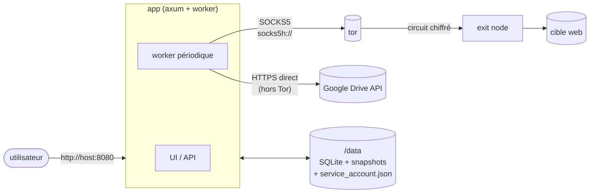
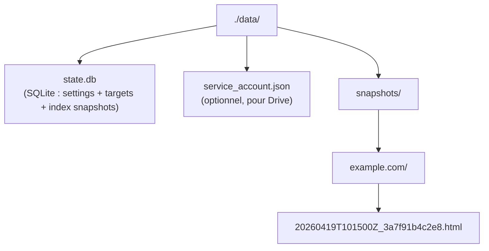

# Rust.Tor.Snapshotter

Service Rust mono-binaire (`rust_tor_snapshotter`) qui capture périodiquement
le HTML brut de pages web via un proxy SOCKS5 Tor, stocke les snapshots
localement (SQLite + fichiers), les miroite optionnellement vers un dossier
Google Drive, et expose un dashboard web pour gérer les cibles et consulter
l'historique.

## Architecture



Un seul binaire, deux tâches tokio :

- **worker** : toutes les `interval_secs`, parcourt les cibles actives, télécharge
  via le client Tor, saute si le `sha256` est identique au snapshot précédent,
  écrit dans `/data/snapshots/<host>/<ts>_<sha>.html`, uploade si Drive activé,
  insère une ligne dans `snapshots`.
- **axum** : sert `/` (HTML/CSS/JS embarqués dans le binaire), l'API JSON et
  la vue des snapshots (iframe sandbox avec `<base href>` injecté).

Les traffics Tor et Drive passent par **deux clients HTTP séparés** — Google
bloque la majorité des exit nodes, et router OAuth via Tor invalide vite les
tokens.

## Conventions de nommage

| Usage | Valeur |
| --- | --- |
| Nom du dépôt / projet | `Rust.Tor.Snapshotter` |
| Crate Rust et exécutable | `rust_tor_snapshotter` |
| Image GHCR | `ghcr.io/venantvr-web/rust.tor.snapshotter` |
| Projet compose / conteneurs | `rust-tor-snapshotter` |

## Prérequis

- Rust stable ≥ 1.82 (pour build local)
- Docker + docker compose (pour l'option conteneurisée, recommandée)
- Un daemon Tor accessible en SOCKS5 (fourni par le compose via
  `osminogin/tor-simple`)

## Lancement (docker compose, recommandé)

```bash
docker compose up -d --build
# UI : http://localhost:8080
```

Check-list premier démarrage :

1. Onglet **Settings** → `tor_socks = socks5h://tor:9050` (déjà par défaut),
   régler l'intervalle, sauver.
2. Onglet **Targets** → ajouter une ou plusieurs URLs.
3. Cliquer **Run now** pour déclencher un cycle immédiat.

Pour exposer sur un autre port :

```bash
HOST_PORT=9090 PORT=9090 docker compose up -d --build
```

## Lancement (dev, sans Docker)

```bash
# Lancer un tor local qui écoute en 9050
sudo systemctl start tor   # ou équivalent

cargo run --release
# UI : http://localhost:8080
```

Variables d'environnement (toutes optionnelles) :

| Variable | Défaut | Rôle |
| --- | --- | --- |
| `DATA_DIR` | `./data` | Dossier persistant (SQLite + SA) |
| `CACHE_DIR` | `$DATA_DIR/snapshots` | Racine des fichiers HTML capturés |
| `GOOGLE_SERVICE_ACCOUNT` | `$DATA_DIR/service_account.json` | Clé SA Google pour l'upload Drive |
| `PORT` | `8080` | Port d'écoute interne du serveur HTTP |
| `BIND_ADDR` | `0.0.0.0:$PORT` | Adresse complète d'écoute (prioritaire sur `PORT`) |
| `RUST_LOG` | `info,rust_tor_snapshotter=debug` | Filtre de traces |

> Toute la config *fonctionnelle* (intervalle, targets, proxy Tor, Drive…) est
> persistée en base et pilotée depuis l'UI — pas de fichier TOML à l'exécution.

## Activer l'upload vers Google Drive

1. Google Cloud Console → activer **Drive API**.
2. Créer un **Service Account**, télécharger sa clé JSON.
3. Dans l'UI, onglet **Settings** → zone "google drive" → glisser le fichier
   JSON dans la dropzone (il est stocké en `/data/service_account.json` avec
   chmod 600).
4. Créer un dossier Drive, le partager avec l'email du SA (droits Editor),
   copier son ID depuis l'URL.
5. Dans l'UI, coller le folder ID, cocher *upload snapshots to drive*, sauver.
6. Bouton **test upload** pour valider la config de bout en bout.

Les fichiers comptent sur le quota de 15 Go du SA. Pour plus de volume,
utilisez un **Shared Drive** et ajoutez-y le SA comme membre.

## Déploiement CasaOS

CasaOS supporte nativement les applis docker-compose.

**Option A — UI**

1. App Store → *Custom Install* → *Import*.
2. Coller le contenu de `casaos/docker-compose.yml`.
3. Ajuster le port hôte publié (défaut `8787`) et le bind path
   (défaut `/DATA/AppData/rust-tor-snapshotter`).
4. Installer.

**Option B — shell**

```bash
sudo mkdir -p /var/lib/casaos/apps/rust-tor-snapshotter
sudo cp casaos/docker-compose.yml /var/lib/casaos/apps/rust-tor-snapshotter/
sudo casaos-cli app-management install rust-tor-snapshotter
```

### Image GHCR

Les workflows GitHub Actions poussent automatiquement l'image multi-arch
(amd64, arm64) sur GHCR à chaque push sur `main` et à chaque tag `v*`.

```bash
docker pull ghcr.io/venantvr-web/rust.tor.snapshotter:latest
```

Pour un build manuel :

```bash
docker build -t ghcr.io/venantvr-web/rust.tor.snapshotter:latest .
docker push  ghcr.io/venantvr-web/rust.tor.snapshotter:latest
```

## API HTTP

| Méthode | Route | Description |
| --- | --- | --- |
| GET | `/api/health` | `ok` |
| GET / POST | `/api/settings` | Lire / mettre à jour la config |
| GET / POST | `/api/targets` | Lister / ajouter une URL |
| DELETE | `/api/targets/:id` | Supprimer une cible |
| POST | `/api/targets/:id/toggle` | Activer / désactiver |
| GET | `/api/snapshots?target_id=&limit=` | Liste paginée |
| GET | `/api/snapshots/:id` | Métadonnées JSON |
| GET | `/api/snapshots/:id/raw` | HTML brut |
| GET | `/api/snapshots/:id/view` | HTML avec `<base href>` injecté |
| GET / POST / DELETE | `/api/drive/service-account` | Statut / upload / suppression du SA |
| POST | `/api/drive/test` | Upload + delete de test vers Drive |
| POST | `/api/trigger` | Déclenche un cycle immédiat |

## Données sur l'hôte



## Tests

```bash
cargo test --all-targets
```

Couvre : CRUD base de données (targets, snapshots, settings), application du
`PRAGMA foreign_keys` et dédup via `sha256`, routes HTTP via `tower::oneshot`
(validation d'URL, upload / suppression du service account, endpoints
`/api/health`, `/api/trigger`), et helpers du worker (`host_of`,
`read_local`).

## Limites

- Capture **HTML brut uniquement** — pas de rendu JS, pas de sous-ressources.
  Pour du post-JS, brancher un headless browser (playwright, chromium
  `--proxy-server=socks5://tor:9050`) dans le worker ; le schéma DB et le
  layout des fichiers ne changent pas.
- La vue "rendered" de l'UI dépend de l'injection de `<base href>` — beaucoup
  de sites ne s'afficheront pas complètement (CSP, CORS, sous-ressources
  bloquées). La vue **source** marche toujours.
- Les exit nodes Tor sont rate-limités et parfois bloqués. Garder des
  intervalles raisonnables (≥ 10 min en prod).

## Intégration avec tor_gatekeeper

Deux modes :

- **Gatekeeper off (par défaut)** : seul ce binaire parle à Tor via son proxy
  SOCKS5. Isolation propre. Le traffic Google part en clair.
- **Gatekeeper on** : tout l'hôte est routé Tor. Dans ce cas, whitelister
  `googleapis.com` dans vos firewall guards sinon l'upload Drive échouera.

## Licence

MIT.
